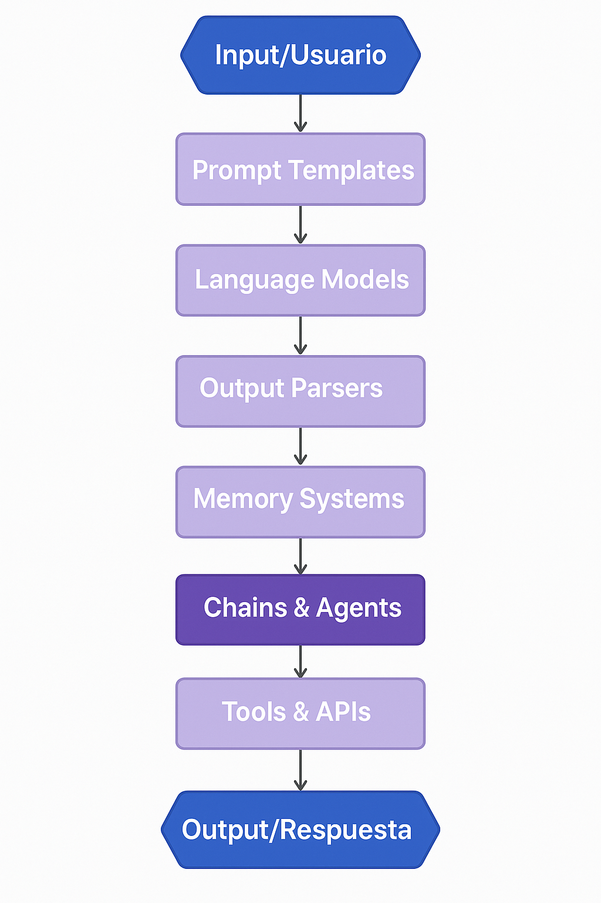

# 🚀 IA para Empresas
## Del Básico al Avanzado - 2025

### Transformando la IA Conversacional en Soluciones Empresariales
<div class="columns-row">


</div>

----

## 📋 Agenda del Curso

<div class="columns">
<div>


### **Módulo 1: Fundamentos**
- ¿Qué es LangChain?
- Arquitectura y conceptos clave
- Instalación y configuración
- Primeros pasos

### **Módulo 2: Componentes Esenciales**
- Models & Prompts
- Chains básicas
- Memory systems
- Output parsers

</div>
<div>

### **Módulo 3: Avanzado**
- Vector databases
- Agents y herramientas
- RAG (Retrieval Augmented Generation)

### **Módulo 4: MCP**
- Onboarding
- MCP Fundamentals, Architecture and Core Concepts
- End-to-end Use case: MCP in Action
- Deployed Use case: MCP in Action

</div>
</div>

---

## 🤔 ¿Qué es LangChain?

<div class="highlight">
<strong>LangChain es un framework de desarrollo que simplifica la creación de aplicaciones potenciadas por modelos de lenguaje (LLMs)</strong>
</div>

### **Características principales:**
- **Modular**: Componentes intercambiables y reutilizables
- **Extensible**: Fácil integración con APIs y servicios externos

- **Escalable**: Desde prototipos hasta aplicaciones empresariales
- **Multi-modelo**: Compatible con OpenAI, Anthropic, Google, y más


---


## 🤔 **¿Por qué LangChain en 2025?**

<div class="highlight">
<strong>LangChain es un framework de desarrollo que simplifica la creación de aplicaciones potenciadas por modelos de lenguaje (LLMs)</strong>
</div>

##
- Ecosistema maduro y estable
- Comunidad activa y documentación robusta
- Soporte nativo para las últimas funcionalidades de IA
- Herramientas empresariales integradas

---

## ⚖️ LangChain vs. APIs Directas
<div class="highlight">
<strong>LangChain añade una capa de abstracción y herramientas para construir aplicaciones de IA más robustas y complejas.</strong>
</div>


<div class="code-block">

</div>

---
## 🏗️ Arquitectura de LangChain




---

## 📦 Componentes Principales

<div class="columns">
<div>

### **🔗 Chains**
- Secuencias de operaciones
- Composición de tareas
- Control de flujo

### **🧠 Memory**
- Conversational memory
- Entity memory
- Summary memory


</div>
<div>

### **📝 Prompts**
- Template management
- Dynamic generation
- Version control

### **🗄️ Retrievers**
- Document search
- Vector similarity
- Hybrid search


</div>
</div>

---

<div class="columns">
<div>


### **🤖 Agents**
- Reasoning engines
- Tool selection
- Dynamic workflows

</div>
<div>


### **🔧 Tools**
- External APIs
- Custom functions
- Chain compositions

</div>
</div>

---

## 💻 Instalación y Setup (2025)

<div class="code-block">

```bash
# LangChain Core (Actualizado Junio 2025)
pip install langchain==0.2.16
pip install langchain-core==0.3.15
pip install langchain-community==0.2.12

# Integraciones específicas
pip install langchain-openai==0.1.22
pip install langchain-anthropic==0.1.16
pip install langchain-google-genai==1.0.8

# Herramientas adicionales
pip install langchain-experimental==0.0.64
pip install langgraph==0.2.11
pip install langsmith==0.1.85
```

</div>

### **⚡ Quick Start:**
```python
from langchain_openai import ChatOpenAI
from langchain_core.messages import HumanMessage

llm = ChatOpenAI(model="gpt-4o-2024-08-06")
response = llm.invoke([HumanMessage(content="¡Hola LangChain!")])
```

---

## 🎯 Primer Ejemplo Práctico

<div class="code-block">

```python
from langchain_openai import ChatOpenAI
from langchain_core.prompts import ChatPromptTemplate
from langchain_core.output_parsers import StrOutputParser

# 1. Configurar el modelo
llm = ChatOpenAI(model="gpt-4o-2024-08-06", temperature=0.7)

# 2. Crear un template de prompt
prompt = ChatPromptTemplate.from_template(
    "Actúa como un consultor empresarial experto. "
    "Analiza el siguiente problema: {problema} "
    "y proporciona 3 soluciones prácticas."
)

# 3. Crear la cadena
chain = prompt | llm | StrOutputParser()

# 4. Ejecutar
resultado = chain.invoke({
    "problema": "Baja productividad en equipos remotos"
})
```

</div>

---

### 🔄 Chains: El Corazón de LangChain **Tipos de Chains Principales:**


<div class="columns">
<div>

#### **🔗 Simple Chain**
```python
from langchain_core.runnables import RunnableSequence

chain = prompt | llm | parser
```

#### **🔀 Sequential Chain**
```python
from langchain.chains import SequentialChain

chain = SequentialChain(
    chains=[chain1, chain2, chain3],
    input_variables=["input"],
    output_variables=["output"]
)
```

</div>
<div>

#### **🌳 Router Chain**
```python
from langchain.chains.router import MultiRouteChain

chain = MultiRouteChain(
    router_chain=router,
    destination_chains=destinations,
    default_chain=default
)
```

#### **🔄 Transform Chain**
```python
from langchain.chains import TransformChain

transform = TransformChain(
    input_variables=["text"],
    output_variables=["output"],
    transform=custom_transform
)
```

</div>
</div>

---

## 🔗 Simple Chain - Procesamiento Lineal Directo
¿Cuándo usarlo?

- Tareas simples de entrada → procesamiento → salida
- Flujos directos sin ramificaciones
- Prototipado rápido
- Casos donde necesitas una sola transformación

---
## 🔀 Casos: Due diligence, análisis complejos, workflows multi-etapa

- Procesos que requieren múltiples etapas
- Cada paso depende del anterior
- Workflows complejos con validaciones
- Análisis profundos que necesitan refinamiento

---

### 🌳 Router Chain - Decisiones Inteligentes
¿Cuándo usarlo?

- Diferentes tipos de input requieren diferentes procesamiento
- Optimización de recursos (usar el modelo más eficiente)
- Escalamiento inteligente según complejidad
- Sistemas de soporte multi-dominio

---

## 🧠 Memory Systems

### **Tipos de Memory en LangChain 2025:**

<div class="highlight">
<strong>La memoria permite que las aplicaciones mantengan contexto entre interacciones</strong>
</div>


---

## 🤖 Agents: IA que Toma Decisiones

### **¿Qué son los Agents?**
- Entidades que pueden **razonar** y **actuar**
- Seleccionan herramientas dinámicamente
- Resuelven problemas complejos paso a paso

<div class="code-block">

```python
# Definir herramientas
tools = [
    DuckDuckGoSearchRun(),
]

# Crear el agent
agent = create_openai_tools_agent(llm, tools, prompt)

```

</div>


---

## 🛠️ Herramientas de Desarrollo

### **Ecosistema LangChain 2025:**

<div class="columns">
<div>

### **🔧 LangSmith**
- Debugging y monitoring
- Performance analytics
- A/B testing
- Cost optimization


</div>


---

## 🤔 ¿Preguntas?


---

### **Recursos Adicionales:**
- 📚 [Documentación oficial LangChain](https://docs.langchain.com)
- 🐙 [GitHub Repository](https://github.com/langchain-ai/langchain)
- 💬 [Community Discord](https://discord.gg/langchain)
- 📺 [LangChain YouTube](https://youtube.com/@LangChain)


--- 

### **Contacto del Instructor:**
- 📧 Email: javier.flores@ia.center
- 💼 LinkedIn: /in/xavierflorex2

---

# ¡Gracias!
## 🚀 Listos para construir el futuro con LangChain

### **Siguiente sesión:**
**Instalación práctica y primer proyecto**

