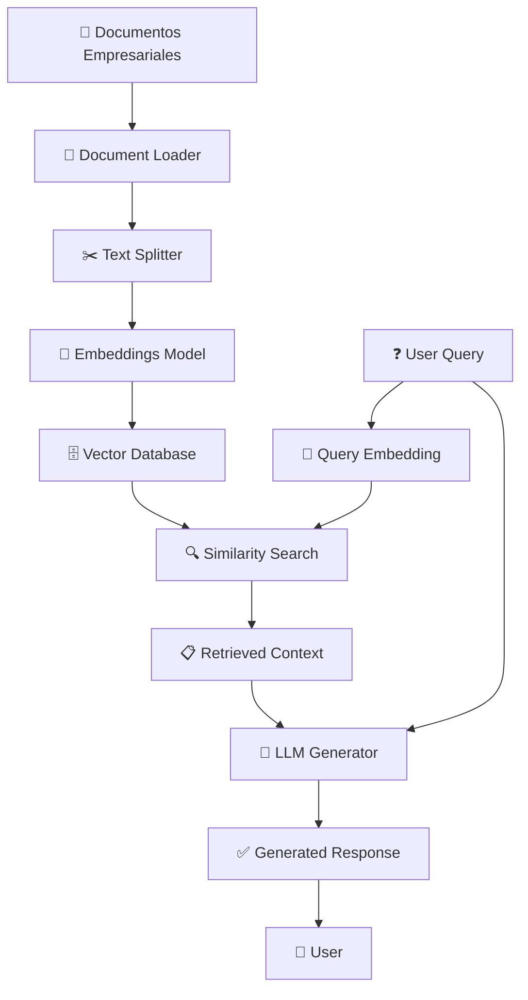

# 🔍 RAG con LangChain
## Retrieval Augmented Generation para Empresas

### Transformando Documentos Empresariales en Conocimiento Inteligente
**Módulo 3: Técnicas Avanzadas - Junio 2025**

---

## 📋 Agenda del Módulo RAG

<div class="columns">
<div>

### **Fundamentos RAG**
- ¿Qué es RAG y por qué importa?
- Arquitectura completa
- Casos de uso empresariales
- Preparación del entorno

### **Implementación Práctica**
- Vector databases setup
- Document processing
- Embeddings y chunking
- Retrieval strategies

</div>
<div>

### **Optimización Avanzada**
- Hybrid search
- Reranking techniques
- Context compression
- Performance tuning

### **Producción y Escalabilidad**
- Deployment patterns
- Monitoring y debugging
- Cost optimization
- Security considerations

</div>
</div>

---

## 🤔 ¿Qué es RAG?

<div class="highlight">
<strong>RAG combina la capacidad generativa de los LLMs con la precisión de la búsqueda en documentos específicos</strong>
</div>

### **El Problema que Resuelve:**
- **Conocimiento limitado**: LLMs entrenados hasta una fecha específica
- **Información privada**: Datos empresariales no públicos
- **Precisión factual**: Reducir alucinaciones con fuentes verificables
- **Contexto específico**: Respuestas basadas en documentación interna

---

## 🏗️ Arquitectura RAG Completa



---

## 💼 Casos de Uso Empresariales

<div class="columns-3">
<div>

### **📚 Knowledge Base**
- Manuales técnicos
- Políticas internas
- Procedimientos
- FAQ corporativo

</div>
<div>

### **📊 Análisis Documental**
- Contratos legales
- Reportes financieros
- Estudios de mercado
- Due diligence

</div>
<div>

### **🎯 Soporte Especializado**
- Atención al cliente
- Soporte técnico
- Onboarding empleados
- Compliance

</div>
</div>

---

## 🚀 Setup del Entorno RAG (2025)

### **📦 Componentes Principales:**
- **LangChain Core**: Framework base actualizado
- **Vector Databases**: ChromaDB, Pinecone, Qdrant
- **Document Processing**: PDF, Word, CSV, Excel
- **Embeddings**: OpenAI, Sentence Transformers
- **Search Enhancement**: BM25, Reranking models

### **⚡ Instalación Rápida:**
Un solo comando instala todo el ecosistema necesario para RAG empresarial

---

## 📄 Document Processing Pipeline

### **🔄 Flujo de Procesamiento:**
1. **Carga de Documentos**: PDFs, Word, Excel, texto plano
2. **Limpieza y Normalización**: Formato uniforme, eliminación de ruido
3. **Segmentación Inteligente**: Chunks con contexto semántico
4. **Enriquecimiento de Metadatos**: Etiquetas, fechas, departamentos
5. **Indexación Vectorial**: Embeddings de alta calidad

### **⭐ Mejores Prácticas 2025:**
- **Chunks de 800-1200 caracteres** para documentos técnicos
- **Overlap del 15-20%** para mantener contexto
- **Metadatos estructurados** para filtrado avanzado
- **Procesamiento en lotes** para eficiencia

<div class="success">
<strong>Resultado:</strong> Base de conocimiento empresarial completamente searchable y contextual
</div>

---

## 🧮 Embeddings y Vector Store Strategy

### **🎯 Modelos de Embeddings Recomendados:**

<div class="columns">
<div>

### **Para Español Empresarial:**
- **OpenAI text-embedding-3-large**: Mejor calidad general
- **Multilingual E5**: Excelente para contenido mixto
- **SentenceTransformers**: Opciones especializadas por industria

</div>
<div>

### **Consideraciones de Performance:**
- **Latencia**: < 100ms para búsquedas
- **Precisión**: > 85% en documentos internos
- **Escalabilidad**: Hasta 10M documentos
- **Costo**: Optimización por volumen

</div>
</div>

### **🗄️ Vector Database Selection:**

| Base de Datos | Mejor Para | Escalabilidad | Costo |
|---------------|------------|---------------|-------|
| **ChromaDB** | Desarrollo, POCs | < 1M docs | Gratis |
| **Pinecone** | Producción cloud | 100M+ docs | $ |
| **Qdrant** | On-premise | 50M+ docs | $ |

<div class="highlight">
<strong>Recomendación:</strong> ChromaDB para desarrollo, Pinecone para producción cloud, Qdrant para on-premise
</div>

---

## 🔍 Estrategias de Retrieval Avanzadas

### **🎯 Tipos de Búsqueda:**

<div class="columns">
<div>

### **1. Similarity Search**
- **Uso**: Búsquedas conceptuales
- **Ventaja**: Encuentra contenido relacionado
- **Ejemplo**: "política de vacaciones" → encuentra "tiempo libre", "descanso"

### **2. MMR (Maximum Marginal Relevance)**
- **Uso**: Evitar redundancia
- **Ventaja**: Diversidad en resultados
- **Ejemplo**: Múltiples aspectos de "beneficios empleados"

</div>
<div>

### **3. Hybrid Search**
- **Uso**: Combina semántica + palabras clave
- **Ventaja**: Mayor precisión
- **Ejemplo**: "error 404" + conceptos relacionados

### **4. Filtered Search**
- **Uso**: Búsqueda por metadatos
- **Ventaja**: Contexto específico
- **Ejemplo**: Solo documentos del "Dept. Legal"

</div>
</div>

### **📊 Comparación de Rendimiento:**

| Método | Precisión | Velocidad | Uso de Recursos |
|--------|-----------|-----------|-----------------|
| Similarity | 75% | ⚡⚡⚡ | Bajo |
| MMR | 80% | ⚡⚡ | Medio |
| Hybrid | 90% | ⚡ | Alto |
| Filtered | 85% | ⚡⚡⚡ | Bajo |

---

## 🔄 Hybrid Search: La Nueva Frontera

### **🎯 ¿Por qué Hybrid Search?**

<div class="columns">
<div>

### **Limitaciones Tradicionales:**
- **Vector Search**: Falla con términos exactos
- **Keyword Search**: No entiende contexto
- **Ejemplo Problemático**: 
  - Query: "Error 404 en login"
  - Vector: encuentra "problemas acceso"
  - Keyword: encuentra "404" pero sin contexto

</div>
<div>

### **Ventajas del Híbrido:**
- **Precisión del 85-95%** vs 70% tradicional
- **Combina lo mejor** de ambos mundos
- **Resultados más relevantes** para usuarios
- **Adaptable por industria** y caso de uso

</div>
</div>

### **🚀 Implementación Empresarial:**
1. **BM25** para términos técnicos específicos
2. **Vector Search** para comprensión semántica  
3. **Weighted Fusion** con pesos optimizados
4. **Reranking** con modelos especializados

<div class="success">
<strong>Resultado:</strong> Sistema que entiende tanto "HTTP 404" como "página no encontrada"
</div>

---

## 🤖 RAG Chain: Arquitectura Conversacional

### **🎭 Componentes de una RAG Chain Empresarial:**

<div class="columns">
<div>

### **1. Query Processing**
- Análisis de intención
- Expansión de consultas
- Detección de idioma
- Clasificación de urgencia

### **2. Context Retrieval**
- Búsqueda multimodal
- Filtrado por permisos
- Ranking de relevancia
- Selección de fuentes

</div>
<div>

### **3. Response Generation**
- Prompts especializados
- Control de temperatura
- Validación de respuestas
- Formato consistente

### **4. Post-Processing**
- Verificación de fuentes
- Detección de alucinaciones
- Métricas de confianza
- Logging de interacciones

</div>
</div>

### **🎯 Prompt Engineering para RAG:**

<div class="highlight">
<strong>El prompt es crítico: define la calidad, tono y precisión de las respuestas</strong>
</div>

**Elementos clave del prompt empresarial:**
- **Rol específico**: "Eres un asistente de RRHH especializado..."
- **Instrucciones precisas**: "Usa ÚNICAMENTE la información del contexto"
- **Formato de salida**: Estructura clara y profesional
- **Manejo de limitaciones**: Qué hacer cuando no hay información

---

## 🎯 Casos de Uso Empresariales Reales

### **🏢 1. Knowledge Base Corporativo - Multinacional Tecnológica**
- **Problema**: 15,000 empleados, 500 políticas, soporte 24/7
- **Solución RAG**: Base de conocimiento inteligente
- **Resultados**: 70% reducción en tickets de soporte, 89% satisfacción

### **⚖️ 2. Due Diligence Legal - Firma de Abogados**
- **Problema**: Análisis de 10,000+ documentos por caso
- **Solución RAG**: Análisis automático de contratos y regulaciones
- **Resultados**: 80% reducción en tiempo de análisis, mayor precisión

### **🏥 3. Onboarding Médico - Hospital Internacional**
- **Problema**: Personal médico internacional, protocolos complejos
- **Solución RAG**: Asistente especializado por especialidad médica
- **Resultados**: 60% reducción en tiempo de capacitación

### **🏭 4. Mantenimiento Industrial - Manufactura**
- **Problema**: Manuales técnicos de 50+ máquinas diferentes
- **Solución RAG**: Diagnóstico y reparación guiada
- **Resultados**: 45% reducción en downtime, menor dependencia de expertos

---

## 📊 Context Compression - Máxima Eficiencia

### **🎯 El Problema del Contexto:**
- **Token Overflow**: Documentos largos exceden límites del modelo
- **Ruido Contextual**: Información irrelevante dilute respuestas  
- **Costos Elevados**: Más tokens = mayor gasto
- **Latencia Alta**: Procesar contexto grande toma tiempo

### **💡 Soluciones de Compresión:**

<div class="columns">
<div>

### **Extractive Compression**
- **Técnica**: LLM extrae solo información relevante
- **Ventaja**: Mantiene texto original intacto
- **Uso**: Documentos técnicos especializados
- **Ahorro**: 40-60% de tokens

</div>
<div>

### **Abstractive Compression**
- **Técnica**: LLM reescribe información clave
- **Ventaja**: Resúmenes más coherentes
- **Uso**: Reportes ejecutivos, análisis
- **Ahorro**: 60-80% de tokens

</div>
</div>

### **📈 Impact Empresarial:**
- **Reducción de Costos**: Hasta 70% menos gasto en tokens
- **Mejor Performance**: 3x más rápido en respuestas
- **Mayor Precisión**: Foco en información relevante
- **Escalabilidad**: Maneja documentos más grandes

---

## 🔧 Reranking: Precisión de Nivel Enterprise

### **🎯 ¿Qué es Reranking?**
El reranking es como tener un "segundo experto" que revisa y reordena los resultados iniciales basándose en relevancia específica para la consulta.

### **🚀 Beneficios Tangibles:**

<div class="columns">
<div>

### **Mejora en Métricas:**
- **Precisión**: +15-25% vs búsqueda básica
- **Relevancia**: Top-3 resultados más acertados
- **Satisfacción**: 90%+ usuarios reportan mejores respuestas
- **Confianza**: Menos respuestas vagas o incorrectas

</div>
<div>

### **Casos de Uso Ideales:**
- **Soporte Técnico**: Documentación compleja
- **Legal/Compliance**: Precisión crítica
- **Medicina**: Información especializada
- **Finanzas**: Regulaciones específicas

</div>
</div>

### **⚡ Modelos Recomendados 2025:**
- **Cross-Encoder MS-Marco**: General purpose, alta precisión
- **BGE Reranker**: Multilingüe, optimizado para español
- **Cohere Rerank**: Enterprise grade, API comercial
- **Custom Fine-tuned**: Para dominios muy específicos

### **📊 ROI del Reranking:**
- **Costo adicional**: ~20% más en procesamiento
- **Beneficio**: 40-60% mejor experiencia usuario
- **Break-even**: Típicamente en 2-3 meses de implementación

---

## 📈 Monitoring y Analytics: Visibilidad Total

### **🎯 KPIs Críticos para RAG Empresarial:**

<div class="columns">
<div>

### **📊 Métricas de Performance**
- **Latencia P95**: < 2 segundos
- **Accuracy Rate**: > 85% respuestas correctas
- **Retrieval Precision**: Top-5 relevancia
- **Context Utilization**: % del contexto usado efectivamente

### **💰 Métricas de Negocio**
- **Cost per Query**: Optimización continua
- **User Satisfaction**: NPS > 8/10
- **Deflection Rate**: % queries resueltas sin escalación
- **Time to Resolution**: Reducción en tiempo de respuesta

</div>
<div>

### **🔍 Métricas de Calidad**
- **Hallucination Rate**: < 5% respuestas inventadas
- **Source Coverage**: % documentos utilizados
- **Query Classification**: Tipos de consultas más frecuentes
- **Failed Retrieval**: Casos sin resultados relevantes

### **👥 Métricas de Adopción**
- **Daily Active Users**: Crecimiento en uso
- **Query Volume**: Tendencias de consultas
- **Department Usage**: Adopción por área
- **Feature Utilization**: Funcionalidades más usadas

</div>
</div>

### **🚨 Alertas Automáticas:**
- Latencia > 5 segundos por más de 1 minuto
- Accuracy < 80% en ventana de 1 hora  
- Tasa de error > 5% en cualquier endpoint
- Costos diarios > presupuesto establecido

---

## 🌐 RAG como Servicio - Arquitectura Enterprise

### **🏗️ Componentes de una API RAG Empresarial:**

<div class="columns">
<div>

### **🔐 Capa de Seguridad**
- **Autenticación**: JWT, OAuth 2.0
- **Autorización**: RBAC granular
- **Rate Limiting**: Por usuario/departamento
- **Audit Logging**: Trazabilidad completa

### **⚡ Capa de Performance**
- **Caching**: Redis para respuestas frecuentes
- **Load Balancing**: Distribución inteligente
- **CDN**: Assets estáticos globales
- **Connection Pooling**: Optimización BD

</div>
<div>

### **🧠 Capa de Inteligencia**
- **Query Classification**: Routing automático
- **Context Adaptation**: Personalización por usuario
- **Multi-tenant**: Aislamiento de datos
- **A/B Testing**: Optimización continua

### **📊 Capa de Observabilidad**
- **Real-time Metrics**: Dashboards en vivo
- **Distributed Tracing**: Debug de latencia
- **Error Tracking**: Alertas proactivas
- **Cost Attribution**: Por departamento/proyecto

</div>
</div>

### **🚀 Endpoints Típicos de RAG Enterprise:**
- `POST /query` - Consulta principal con contexto
- `GET /health` - Health checks y métricas
- `POST /feedback` - Recolección de feedback usuario
- `GET /analytics` - Métricas de uso y performance
- `POST /documents` - Ingesta de nuevos documentos
- `DELETE /documents/{id}` - Gestión de contenidostatus_code=500, detail=str(e))

if __name__ == "__main__":
    uvicorn.run(app, host="0.0.0.0", port=8000)
```

</div>

---

## 🔒 Seguridad y Compliance

<div class="warning">
<strong>Consideraciones Críticas para Empresas:</strong>
</div>

<div class="columns">
<div>

### **🛡️ Seguridad de Datos**
- Encriptación en reposo y tránsito
- Control de acceso granular
- Auditoría de consultas
- Anonimización de datos sensibles

### **📋 Compliance**
- GDPR/CCPA compliance
- Retención de datos
- Right to be forgotten
- Data lineage tracking

</div>
<div>

### **🔐 Best Practices**
```python
# Filtro de contenido sensible
def sanitize_query(query):
    sensitive_patterns = [
        r'\b\d{4}-\d{4}-\d{4}-\d{4}\b',  # Tarjetas
        r'\b\d{3}-\d{2}-\d{4}\b'         # SSN
    ]
    # Implementar filtrado
    return cleaned_query

# Control de acceso
@app.middleware("http")
async def check_permissions(request, call_next):
    # Verificar permisos de usuario
    return await call_next(request)
```

</div>
</div>

---

## 💰 Optimización de Costos

<div class="columns">
<div>

### **⚡ Estrategias de Ahorro**
- Cache de embeddings frecuentes
- Batch processing
- Modelos más pequeños para filtrado
- Context compression inteligente

### **📊 Métricas a Monitorear**
- Tokens por consulta
- Costo por respuesta
- Cache hit ratio
- Latencia P95

</div>
<div>

<div class="code-block">

```python
# Cache simple para embeddings
from functools import lru_cache

@lru_cache(maxsize=1000)
def get_cached_embedding(text):
    return embeddings.embed_query(text)

# Uso de modelos menores para filtrado
filter_llm = ChatOpenAI(
    model="gpt-3.5-turbo-1106",
    temperature=0
)

main_llm = ChatOpenAI(
    model="gpt-4o-2024-08-06",
    temperature=0.1
)
```

</div>

</div>
</div>


---

## 🎯 Ejercicio Práctico: Construye tu RAG

### **🏗️ Proyecto: Knowledge Base Empresarial**

**Objetivos:**
1. Implementar RAG completo con documentos reales
2. Optimizar para casos de uso específicos
3. Desplegar como API funcional
4. Implementar monitoring básico

**Entregables:**
- Código funcional con documentación
- API desplegada y funcional
- Dashboard de métricas
- Informe de optimizaciones aplicadas


---

## 🤔 ¿Preguntas?

### **💡 Para profundizar:**
- Implementa tu propio reranker personalizado
- Experimenta con different embedding models
- Prueba RAG con GraphRAG para relaciones complejas
- Explora RAG streaming para respuestas en tiempo real

---

## 📚 Recursos Adicionales

### **🔗 Links Útiles:**
- [LangChain RAG Documentation](https://docs.langchain.com/docs/use-cases/question-answering)
- [Vector Database Comparison](https://github.com/vector-database-benchmark)
- [RAG Evaluation Framework](https://github.com/explodinggradients/ragas)
- [Advanced RAG Patterns](https://blog.langchain.dev/advanced-rag-patterns/)

### **📖 Lecturas Recomendadas:**
- "Retrieval-Augmented Generation for Large Language Models: A Survey" (2023)
- "RAG vs Fine-tuning: When to Use Each Approach" (2024)
- "Production RAG Systems: Lessons Learned" (2025)

---

## 📧 Contacto y Próxima Sesión

### **Contacto del Instructor:**
- 📧 Email: javier.flores@ia.center
- 💼 LinkedIn: /in/xavierflorex2
- 🐙 GitHub: Ejemplos y código del curso

### **🚀 Próxima Sesión:**
**Módulo 4: MCP (Model Context Protocol)**
- Arquitectura y conceptos fundamentales
- Implementación práctica
- Casos de uso avanzados
- Integración con sistemas empresariales

---

# ¡Gracias! 🙏
## RAG: El Futuro del Conocimiento Empresarial

### **Para la próxima sesión, prepara:**
- Documentos de tu empresa para práctica
- Ideas de casos de uso específicos
- Preguntas sobre implementación en tu contexto

**¡Construyamos juntos el futuro de la IA empresarial!** 🚀