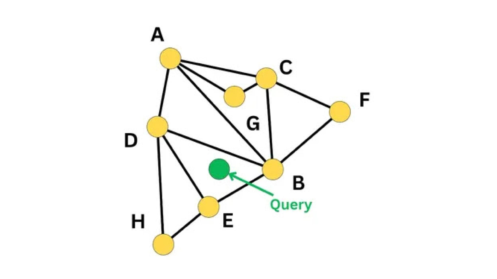
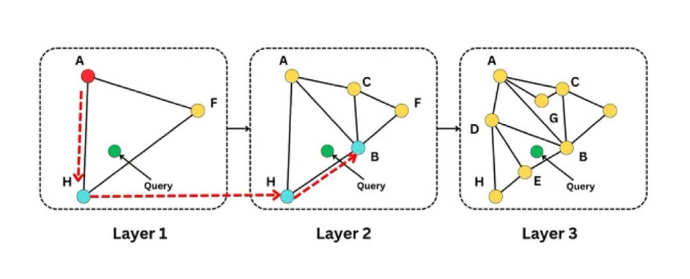

# 🧠 **¿Qué son los Embeddings?**
## **La Revolución Silenciosa que está Transformando la IA**

De Palabras a Números: Cómo las Máquinas Entienden el Lenguaje Humano

---

## 🤔 **La Historia Comienza con un Problema...**

### **Imagina que eres una computadora** 🤖

**¿Cómo entenderías estas palabras?**
- "Rey"
- "Reina" 
- "Hombre"
- "Mujer"

**Para ti son solo letras... ¡No tienen significado!**

🤷‍♂️

<h3>Las computadoras no entienden palabras... ¡solo números!</h3>

---

## ✨ **Entonces llegan los Embeddings...**

### **Los Embeddings son la traducción mágica**

**Convierten palabras en vectores (listas de números) que las máquinas SÍ pueden entender**

### **Antes (Texto):**
- "Rey" = ???
- "Reina" = ??? 
- "Perro" = ???

### **Después (Vectores):**
- "Rey" = [0.2, -0.8, 0.5, ...]
- "Reina" = [0.3, -0.7, 0.4, ...]
- "Perro" = [-0.1, 0.2, -0.9, ...]

<h3>🎯 ¡Ahora la IA puede "entender" las relaciones!</h3>

---

## 🧩 **La Magia de las Relaciones Semánticas**

### **¿Qué hace especiales a los embeddings?**

**Las palabras similares tienen vectores similares**

### **👑 Realeza:**
- Rey: [0.8, 0.2, 0.1]
- Reina: [0.7, 0.3, 0.1]
- Príncipe: [0.6, 0.2, 0.2]

**¡Están cerca en el espacio vectorial!**

### **🐕 Animales:**
- Perro: [0.1, 0.8, 0.3]
- Gato: [0.2, 0.7, 0.4]
- León: [0.3, 0.6, 0.5]

**¡También están agrupados!**

🤯

<h3>¡La IA descubre relaciones que nosotros ni sabíamos!</h3>

---

## 📊 **El Álgebra Mágica de las Palabras**

### **La ecuación más famosa de la IA:**

👑 - 👨 + 👩 = 👸

<h3>Rey - Hombre + Mujer = Reina</h3>

**¡Los embeddings pueden hacer matemáticas con conceptos!**

### **¿Cómo es posible esto?**

Los embeddings capturan **relaciones semánticas** de manera que:
- "Rey" tiene la relación "masculino" con "Reina"
- Si quitamos "masculino" y agregamos "femenino"
- ¡Obtenemos "Reina"!

---

## 🌍 **¿Por qué Importa en el Mundo Real?**

### **❌ Búsqueda Tradicional:**
**Usuario busca:** "problemas de rendimiento"

**Sistema encuentra:** Solo documentos con esas palabras exactas

**Se pierde:** "lentitud", "bajo desempeño", "optimización"

### **✅ Búsqueda con Embeddings:**
**Usuario busca:** "problemas de rendimiento"

**Sistema encuentra:** Todo lo relacionado semánticamente

**Incluye:** "lentitud", "lag", "bottleneck", "optimization"

<h3>🎯 ¡10x más resultados relevantes!</h3>

---

## 🏢 **Casos de Uso Empresariales Reales**

### **🛒 E-commerce**
**Cliente busca:** "zapatos para correr"
**Encuentra:** sneakers, running shoes, calzado deportivo

### **⚖️ Legal**
**Abogado busca:** "contrato de arrendamiento"
**Encuentra:** acuerdo de renta, lease agreement

<h3>💡 ¡La IA entiende el contexto como un humano!</h3>

---

## 📈 **Los Números que Impresionan**

85%

<h3>Mejora en precisión de búsqueda</h3>

70%

<h3>Reducción en tiempo de búsqueda</h3>

50+

<h3>Idiomas soportados</h3>

24/7

<h3>Disponibilidad del sistema</h3>

---

## 🎯 **¿Dónde Guardamos Todos Estos Vectores?**

### **🏠 Para Proyectos Pequeños:**
- **ChromaDB**: Fácil de usar
- **FAISS**: Súper rápido localmente

### **🏢 Para Empresas:**
- **Pinecone**: En la nube, sin complicaciones
- **Weaviate**: Potente y flexible

### **🚀 Integraciones :**
- **Postgres**: pgVector
- **Mongose**: MongoDB Atlas

### **⚡ Lo que Necesitas Saber:**
- Más vectores = Más memoria
- Más consultas = Más CPU
- Más precisión = Más tiempo

---

###  **¿Cómo se Construye un Sistema de Embeddings?**

#### **Paso 1: Preparar los Datos** 
Tomar documentos y dividirlos en pedazos pequeños

#### **Paso 2: Crear Embeddings** 
Convertir cada pedazo en vectores usando IA

#### **Paso 3: Almacenar** 
Guardar vectores en una base de datos especializada

#### **Paso 4: Buscar** 
Cuando llega una consulta, encontrar vectores similares

#### **Paso 5: Responder** 
Devolver los documentos más relevantes

---

## 🌟 **La Diferencia Entre Bueno y Excelente**

### **😐 Sistema Básico:**
- Búsqueda solo por palabras
- Resultados limitados
- No entiende contexto
- Un solo idioma

### **🚀 Sistema con Embeddings:**
- Búsqueda semántica
- Resultados comprensivos
- Entiende intención
- Multiidioma natural

⭐

<h3>Los embeddings son la diferencia entre buscar y ENCONTRAR</h3>

---

## 🔮 **El Futuro ya está Aquí**

### **Lo que viene en 2025-2026:**

- **Búsqueda multimodal**: Texto + Imágenes + Audio + Video
- **IA que aprende**: Sistemas que mejoran automáticamente
- **Tiempo real**: Actualizaciones instantáneas
- **Personalización**: Cada usuario tiene su propia experiencia

🚀

<h3>¡Y todo empieza con entender los embeddings!</h3>

---

### 🎓 **¿Qué Aprenderemos Hoy?**

#### **Módulo 1: Fundamentos** 
Cómo funcionan realmente los embeddings

#### **Módulo 2: Implementación** 
Construir tu primer sistema paso a paso busqueda en archivo pdf

#### **Módulo 3: Escalar** 
Constuir un sistema de búsqueda escalable y eficiente, usando un herramientas de las longchain

#### **Módulo 4: Ingregar con una base datos**
Constuir un sistema de búsqueda en basedatos de vectores

---

Los algoritmos ANN son la clave para la búsqueda de similitud a gran escala en bases de datos vectoriales.
En lugar de encontrar el "vecino más cercano" exacto (que es computacionalmente costoso), los ANN encuentran una aproximación muy cercana en una fracción del tiempo.

---

Aquí tienes una diapositiva que explica cómo funcionan los algoritmos de Vecinos Más Cercanos Aproximados (ANN) en las bases de datos vectoriales para una búsqueda eficiente:

---

## **Búsqueda Eficiente de Documentos: Algoritmos ANN en Bases de Datos Vectoriales**

---

**¿Cómo Funcionan (Principios Clave)?**

- Indexación Inteligente:
    
- Compromiso entre Precisión y Velocidad:
   
- Técnicas Comunes:
    * Basados en Gráficos (ej. HNSW - Hierarchical Navigable Small World)
    * Basados en Árboles (ej. KD-Trees, ANNOY):
    * Basados en Hashing (ej. LSH - Locality Sensitive Hashing):
    * Basados en Agrupamiento (ej. FAISS):

---

---

# 🎯 **¿Preguntas Antes de Empezar?**

🤔

### **Recuerda: No hay preguntas tontas**
### **Solo oportunidades para aprender más**

<h3>🚀 Próximo: Vamos a ver esto en acción con ejemplos reales</h3>

